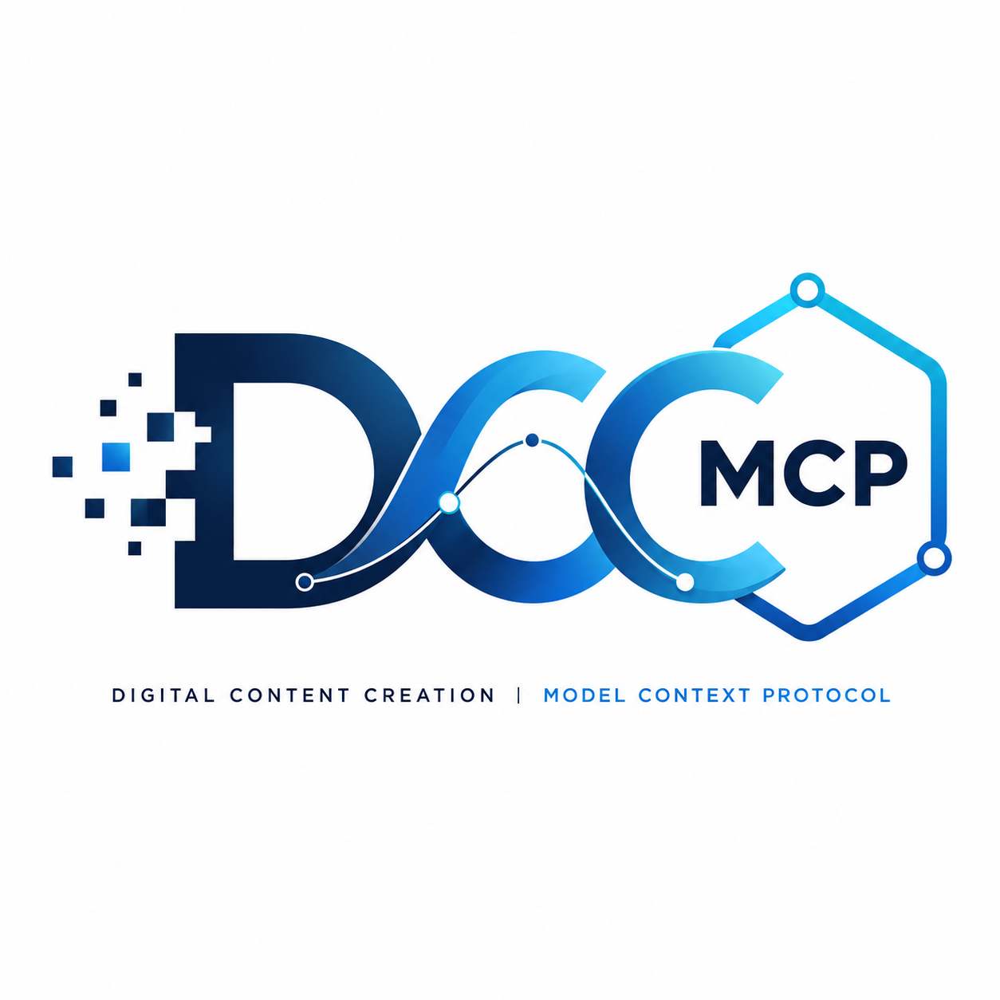

  

# DCC MCP

DCC-MCP builds open infrastructure for AI agents to safely discover, inspect, and operate Digital Content Creation applications through the Model Context Protocol.

## Projects

- [dcc-mcp-core](https://github.com/dcc-mcp/dcc-mcp-core) - the shared Rust and Python runtime for skills, gateway routing, discovery, telemetry, and DCC-safe execution.
- [dcc-mcp-maya](https://github.com/dcc-mcp/dcc-mcp-maya) - Autodesk Maya adapter and skills.
- [dcc-mcp-blender](https://github.com/dcc-mcp/dcc-mcp-blender) - Blender add-on with an embedded MCP server.
- [dcc-mcp-houdini](https://github.com/dcc-mcp/dcc-mcp-houdini) - SideFX Houdini adapter and workflow skills.
- [dcc-mcp-photoshop](https://github.com/dcc-mcp/dcc-mcp-photoshop) - Adobe Photoshop bridge through UXP WebSocket automation.
- [dcc-mcp-zbrush](https://github.com/dcc-mcp/dcc-mcp-zbrush) - ZBrush adapter for MCP-driven creative workflows.

## Principles

- Skills-first operation over raw scripting.
- DCC-agnostic core contracts with host-specific safety boundaries.
- Progressive capability discovery for token-efficient agents.
- Production-minded diagnostics, audit trails, and recovery paths.

Start with [dcc-mcp-core](https://github.com/dcc-mcp/dcc-mcp-core) for the runtime, gateway, and adapter authoring contracts.

## Contributing

Issues and pull requests are welcome. Please open an issue for bugs, integration gaps, documentation improvements, or new DCC workflow ideas, and send focused PRs when you want to help improve the runtime, adapters, skills, docs, or examples.
