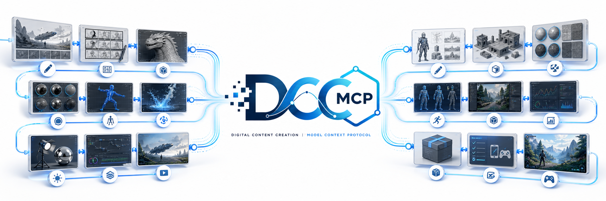

<!-- markdownlint-disable MD013 MD033 MD041 -->

<p align="center">
  
</p>

<p align="center">
  <a href="./README.md">English</a> | 中文
</p>

# DCC MCP

**Skills 驱动，让 Agent 可以可靠操作真实创作工具的公共基础设施。**

DCC-MCP（Digital Content Creation Model Context Protocol）不做 Agent，也不规定
用户必须选择哪个 Agent。我们把不断扩展的桌面 DCC、游戏引擎、二维工具、生产管理
系统、资产提供器、性能分析器和工作室自研宿主接入同一套发现、执行、安全与运维契约。

## Agent 入口

按照任务安装对应的公开 Skill。操作已有 DCC 只需要 `dcc-mcp`；两个 creator
Skill 分别负责专项开发边界。

| Agent 任务 | 公开 Skill |
| --- | --- |
| 操作在线 DCC、发现工具、安装扩展、分析失败并准备安全的 Bug 报告 | [`@loonghao/dcc-mcp`](https://clawhub.ai/loonghao/skills/dcc-mcp) |
| 创建或现代化完整的 DCC-MCP adapter 与 runtime | [`@loonghao/dcc-mcp-creator`](https://clawhub.ai/loonghao/skills/dcc-mcp-creator) |
| 创建、验证或改进 DCC 专项 Skill 包 | [`@loonghao/dcc-mcp-skills-creator`](https://clawhub.ai/loonghao/skills/dcc-mcp-skills-creator) |

```bash
openclaw skills install @loonghao/dcc-mcp
openclaw skills install @loonghao/dcc-mcp-creator
openclaw skills install @loonghao/dcc-mcp-skills-creator
# 其他 Agent Skills 宿主可直接使用 ClawHub CLI：
npx --yes clawhub@0.23.1 install @loonghao/dcc-mcp
npx --yes clawhub@0.23.1 install @loonghao/dcc-mcp-creator
npx --yes clawhub@0.23.1 install @loonghao/dcc-mcp-skills-creator
```

安装后开启新的 agent turn。默认工作流是 `dcc-mcp` + `dcc-mcp-cli`：先用
`dcc-mcp-cli list` 盘点实例，用 `dcc-mcp-cli doctor` 检查启动状态，再执行
`search -> describe -> call`。Skill 还会指导 Agent 保留 trace 证据、自我分析
失败层，并把脱敏后的 Bug 报告路由到对应的 Skill、adapter 或 Core 项目。
CLI 尚未安装时，请遵循
[`dcc-mcp-cli` 已验证安装指南](https://github.com/dcc-mcp/dcc-mcp-core/blob/main/README_zh.md#安装独立-cli)。

## 为什么做这个项目

最直接的 DCC Agent Demo，是让模型临时写一段 `mayapy`、`hython` 或 Blender
Python，然后马上执行。Demo 可以这样做，生产不能靠每次都让模型现场写对脚本。

重复生成代码会持续消耗 Token，结果也会随模型、提示词和上下文变化。每个 adapter
还要重新处理通信、主线程、参数校验、进程生命周期、实例路由和日志。这些公共工程
才是 DCC 集成里最费时间、也最容易踩坑的部分。

DCC-MCP 把它们收进一个可复用框架：

| 层次 | 可以直接复用的能力 |
| --- | --- |
| 接口接入 | MCP/REST endpoint、Host RPC/IPC、类型化 schema、resources、prompts、结构化结果 |
| DCC 运行时 | 主线程亲和、readiness、多实例路由、异步 job、取消、checkpoint、workflow、artefact 交接 |
| Skill 交付 | 有版本的 `SKILL.md` 包、渐进式发现、lint/schema 校验、hot reload、状态持久化、marketplace、项目/团队作用域 |
| 生产运维 | CLI、gateway、Admin UI、权限策略、audit、trace、logs、metrics、health check、回放 |

Agent 会换，模型会升级，但工作室的 DCC 接口、权限边界和 pipeline 经验仍需要长期
维护。框架把这些投入沉淀成可以复用的工程资产。

## MCP 是入口，不是能力上限

我们复用 MCP 这个行业标准接口，不再发明一套只有自己能用的私有协议。但框架并不
局限于 MCP：只要宿主提供稳定的 Python、C++、HTTP、command port 或原生插件接口，
就可以接入同一套控制面。

我们也不会替代厂商已经做好的能力。Unreal Engine 5.8 加入了
[实验性的官方 MCP 和 Toolset Registry](https://dev.epicgames.com/documentation/unreal-engine/unreal-mcp-in-unreal-editor)。
我们的
[`unreal-official-mcp` Skill](https://github.com/dcc-mcp/dcc-mcp-unreal/blob/main/src/dcc_mcp_unreal/skills/unreal-official-mcp/SKILL.md)
可以启用并桥接这些官方 toolset，不重新分发 Epic 插件，也不修改官方工具名称和
schema。官方能力、DCC-MCP 自己的能力和工作室内部工具，可以进入同一套 Agent
工作流。

### 没有 API 时：UI Control

让一个新工具增加 AI 接口通常不难。更难的是，工作室里已经使用多年的旧工具没有
API、不能修改源码，或者一部分流程只存在于窗口、弹窗、启动器和 WebView 里，怎么让
Agent 也能调用它们。

dcc-mcp-core 为此提供了类似 Computer Use 的 **UI Control** 能力。它通过 Qt、
原生无障碍接口、WebView 或宿主 UI 后端，执行
`snapshot -> find -> act -> wait -> verify` 的确定性流程。能用原生 Skill/API 时
仍然优先使用；全桌面访问默认拒绝，UI 操作必须有明确作用域，经过策略检查、审计和
结果验证。详细说明见
[UI Control 工作流](https://github.com/dcc-mcp/dcc-mcp-core/blob/main/docs/zh/guide/ui-control-workflows.md)。

## 为什么以 Skill 为生产单元

Skill 不是把脚本换一个目录存放。它把已经验证过的 pipeline 经验，变成有版本、
有 schema、可测试、可分发的工具。

一个成本更低的模型从零编写场景逻辑可能不稳定，但如果它只需要选择一个说明清楚的
工具，再填写经过校验的参数，也能更稳定地完成任务。Skill 可以减少临场代码生成、
Token 消耗和模型差异带来的结果波动。

大型工作室还可以按项目、部门和制作阶段分发不同的 Skill。团队已有的 pipeline
不用推倒重来，只需要逐步封装成 Agent 可以可靠调用的能力。

对 TD/TA 来说，Skill 是把内部需求变成可复用能力的最短路径。宿主连接、主线程执行、
路由、安全和可观测性继续由 Core 与 adapter 负责；项目命名、场景检查、资产准备、
发布卡点、缓存/导出规范和审核交接，则可以直接封装进 `SKILL.md`、`tools.yaml` 和
团队现有脚本。完成的 Skill 可以独立测试、按项目分发，并进入公开或内部 Marketplace，
不需要 fork 控制面，也不需要为每个项目重写 adapter。

## 持续扩展的生态

| 领域 | 项目与 Skills |
| --- | --- |
| 基础设施与分发 | [`dcc-mcp-core`](https://github.com/dcc-mcp/dcc-mcp-core)、[`marketplace`](https://github.com/dcc-mcp/marketplace) |
| 桌面 DCC | [Maya](https://github.com/dcc-mcp/dcc-mcp-maya)、[Blender](https://github.com/dcc-mcp/dcc-mcp-blender)、[Houdini](https://github.com/dcc-mcp/dcc-mcp-houdini)、[3ds Max](https://github.com/dcc-mcp/dcc-mcp-3dsmax)、[Nuke](https://github.com/dcc-mcp/dcc-mcp-nuke)、[Katana](https://github.com/dcc-mcp/dcc-mcp-katana)、[MotionBuilder](https://github.com/dcc-mcp/dcc-mcp-mobu)、[ZBrush](https://github.com/dcc-mcp/dcc-mcp-zbrush) |
| 设计与内容工具 | [Photoshop](https://github.com/dcc-mcp/dcc-mcp-photoshop)、[Substance 3D Designer](https://github.com/dcc-mcp/dcc-mcp-substance3d-designer)、[Substance 3D Painter](https://github.com/dcc-mcp/dcc-mcp-substance3d-painter)、[After Effects](https://github.com/dcc-mcp/dcc-mcp-aftereffects)、[Premiere](https://github.com/dcc-mcp/dcc-mcp-premiere)、[GIMP](https://github.com/dcc-mcp/dcc-mcp-gimp)、[Krita](https://github.com/dcc-mcp/dcc-mcp-krita) |
| 游戏与二维引擎 | [Unreal Engine](https://github.com/dcc-mcp/dcc-mcp-unreal)、[Unity](https://github.com/dcc-mcp/dcc-mcp-unity)、[Godot](https://github.com/dcc-mcp/dcc-mcp-godot)、[Tiled](https://github.com/dcc-mcp/dcc-mcp-tiled)、[Material Maker](https://github.com/dcc-mcp/dcc-mcp-material-maker) |
| Pipeline 与质量 | [OpenUSD](https://github.com/dcc-mcp/dcc-mcp-openusd)、[Flow Production Tracking](https://github.com/dcc-mcp/dcc-mcp-fpt)、[MaterialX](https://github.com/dcc-mcp/dcc-materialx)、[纹理 Pipeline](https://github.com/dcc-mcp/dcc-texture-pipeline)、[Pipeline Publish](https://github.com/dcc-mcp/dcc-pipeline-publish)、[RenderDoc](https://github.com/dcc-mcp/dcc-mcp-renderdoc)、[Tracy](https://github.com/dcc-mcp/dcc-mcp-tracy) |
| Marketplace Skills | 资产提供器、2D/3D 生成、UI 自动化、绑定、程序化制作、游戏发行与运行时验收 |

[官方 Marketplace](https://github.com/dcc-mcp/marketplace) 让这些可选能力可以搜索、
安装和升级，也支持工作室维护自己的内部目录。

### 扩展 Skill 能力目录

[官方目录](https://github.com/dcc-mcp/marketplace/blob/main/marketplace.json)
当前发布了以下全部可选能力。安装前，Agent 应先搜索实时目录：

```bash
dcc-mcp-cli marketplace search --query "<capability>" --limit 20
dcc-mcp-cli marketplace install <package_name> --dcc <dcc_name>
```

#### 绑定、程序化制作与 UI 自动化

| 扩展 Skill | 能力 |
| --- | --- |
| [`dcc-mcp-maya-mgear`](https://github.com/dcc-mcp/dcc-mcp-maya-mgear) | 在 Maya 中检查、构建和管理 mGear Shifter rig |
| [`dcc-mcp-maya-advancedskeleton`](https://github.com/dcc-mcp/dcc-mcp-maya-advancedskeleton) | 检查模板并创建、导入、构建或重建 AdvancedSkeleton rig |
| [`dcc-mcp-maya-procedural-architecture`](https://github.com/dcc-mcp/dcc-mcp-maya-procedural-architecture) | 生成可复现的 Maya 房屋、Arnold 材质和可选 CC0 HDR 灯光 |
| [`dcc-ui-qt-inspector`](https://github.com/dcc-mcp/dcc-ui-qt-inspector) | 跨 PySide/PyQt DCC 宿主发现 Qt 窗口、控件和 selector 状态 |
| [`dcc-ui-qt-actions`](https://github.com/dcc-mcp/dcc-ui-qt-actions) | 点击控件、触发 action、设置值并驱动旧版 Qt UI 工作流 |
| [`dcc-ui-workflow-memory`](https://github.com/dcc-mcp/dcc-ui-workflow-memory) | 保存已验证的 UI selector、操作 recipe 和失败记录 |

#### 3D 生成与可复用资产源

| 扩展 Skill | 能力 |
| --- | --- |
| [`dcc-ai-hunyuan3d`](https://github.com/dcc-mcp/dcc-ai-hunyuan3d) | 提交和查询腾讯混元文生/图生 3D 任务 |
| [`dcc-ai-tripo3d`](https://github.com/dcc-mcp/dcc-ai-tripo3d) | 创建、查询和下载 Tripo 文生/图生/多视图 3D 任务 |
| [`dcc-asset-polyhaven`](https://github.com/dcc-mcp/dcc-asset-polyhaven) | 浏览和下载 CC0 Poly Haven 模型、HDRI 与纹理 |
| [`dcc-asset-godot-store`](https://github.com/dcc-mcp/dcc-asset-godot-store) | 搜索和下载可复用的 Godot Asset Store 插件与项目 |
| [`dcc-asset-blender-extensions`](https://github.com/dcc-mcp/dcc-asset-blender-extensions) | 搜索和下载经过 checksum 校验的官方 Blender 扩展 |
| [`dcc-asset-ambientcg`](https://github.com/dcc-mcp/dcc-asset-ambientcg) | 搜索和下载免费 ambientCG 材质、HDRI 与模型 |
| [`dcc-asset-nasa3d`](https://github.com/dcc-mcp/dcc-asset-nasa3d) | 搜索和下载带使用声明的 NASA 3D 资源 |
| [`dcc-asset-smithsonian3d`](https://github.com/dcc-mcp/dcc-asset-smithsonian3d) | 搜索和下载 Smithsonian Open Access CC0 3D 文件 |
| [`dcc-asset-kenney`](https://github.com/dcc-mcp/dcc-asset-kenney) | 搜索和下载 CC0 Kenney 游戏资产包 |
| [`dcc-asset-quaternius`](https://github.com/dcc-mcp/dcc-asset-quaternius) | 搜索和检查 CC0 Quaternius 游戏资产包 |
| [`dcc-asset-objaverse`](https://github.com/dcc-mcp/dcc-asset-objaverse) | 浏览 Objaverse 元数据并下载 Creative Commons GLB 对象 |
| [`dcc-asset-gltf-sample-assets`](https://github.com/dcc-mcp/dcc-asset-gltf-sample-assets) | 下载用于测试与验证的 Khronos glTF Sample Assets |
| [`dcc-asset-sketchfab`](https://github.com/dcc-mcp/dcc-asset-sketchfab) | 下载允许下载的 Sketchfab 模型及其署名元数据 |
| [`dcc-asset-google-scanned-objects`](https://github.com/dcc-mcp/dcc-asset-google-scanned-objects) | 从 Gazebo Fuel 搜索和下载 Google Scanned Objects |

#### 图像、材质、媒体、地理数据与插件

| 扩展 Skill | 能力 |
| --- | --- |
| [`dcc-ai-openai-image`](https://github.com/dcc-mcp/dcc-ai-openai-image) | 生成和编辑纹理源图，并返回经过验证的资产描述 |
| [`dcc-texture-pipeline`](https://github.com/dcc-mcp/dcc-texture-pipeline) | 使用 OpenImageIO 和 OpenColorIO 检查、转换与优化纹理 |
| [`dcc-materialx`](https://github.com/dcc-mcp/dcc-materialx) | 创建、检查和验证可移植的 MaterialX 文档 |
| [`dcc-asset-pexels-video`](https://github.com/dcc-mcp/dcc-asset-free-media) | 搜索和下载带署名元数据的 Pexels 视频 |
| [`dcc-asset-mixkit-free-media`](https://github.com/dcc-mcp/dcc-asset-free-media) | 下载带许可元数据的 Mixkit 视频、音乐、音效和 AE 模板 |
| [`dcc-asset-game-icons`](https://github.com/dcc-mcp/dcc-asset-free-media) | 搜索和下载用于游戏界面的 CC BY SVG 图标 |
| [`dcc-asset-google-fonts`](https://github.com/dcc-mcp/dcc-asset-free-media) | 搜索 Google Fonts 并下载带许可元数据的已验证字体 |
| [`dcc-asset-openstreetmap-city`](https://github.com/dcc-mcp/dcc-asset-geospatial) | 下载指定边界内带署名的 OpenStreetMap 城市 GeoJSON |
| [`dcc-asset-overture-city`](https://github.com/dcc-mcp/dcc-asset-geospatial) | 下载指定边界内带许可信息的 Overture Maps 城市 GeoJSON |
| [`dcc-plugin-github-releases`](https://github.com/dcc-mcp/dcc-asset-free-media) | 检查开源项目许可并下载带 SHA-256 元数据的 release 插件 |

#### Pipeline 发布与游戏交付

| 扩展 Skill | 能力 |
| --- | --- |
| [`dcc-pipeline-publish`](https://github.com/dcc-mcp/dcc-pipeline-publish) | 创建连接 DCC 导出、OpenUSD、渲染农场与 ShotGrid/FPT 的已验证清单 |
| [`dcc-game-release-package`](https://github.com/dcc-mcp/dcc-pipeline-publish) | 将预构建 Unreal、Unity、Godot Windows 游戏打包为安装包、SteamPipe 或 WeGame 交付物 |
| [`dcc-game-runtime-acceptance`](https://github.com/dcc-mcp/dcc-pipeline-publish) | 执行有边界的游戏运行验收并保存带哈希证据 |
| [`dcc-game-pv-capture`](https://github.com/dcc-mcp/dcc-pipeline-publish) | 为 HyperFrames PV 剪辑规划并保存精确窗口的游戏画面 |

<!-- markdownlint-disable MD013 -->
[](https://github.com/dcc-mcp/marketplace)
<!-- markdownlint-enable MD013 -->

## 让 Agent 调用不再是黑盒

Gateway Admin 提供 calls、traces、logs、health、stats 和使用活动。团队可以看到
Agent 选择了什么工具、失败发生在哪一层、哪些 Skill 被频繁调用。发现重复失败后，
可以修改说明、schema 或实现，再用真实调用验证效果，形成工具和 Skill 的迭代闭环。

## 从这里开始

| 需求 | 项目 |
| --- | --- |
| 开发 adapter 或操作在线 DCC | [`dcc-mcp-core`](https://github.com/dcc-mcp/dcc-mcp-core) |
| 发现和分发通用 Skill | [`marketplace`](https://github.com/dcc-mcp/marketplace) |
| 浏览完整生态 | [DCC-MCP 全部仓库](https://github.com/orgs/dcc-mcp/repositories) |
| 接入游戏引擎 | [Unreal Engine](https://github.com/dcc-mcp/dcc-mcp-unreal)、[Unity](https://github.com/dcc-mcp/dcc-mcp-unity)、[Godot](https://github.com/dcc-mcp/dcc-mcp-godot) |
| 建设 Pipeline | [OpenUSD](https://github.com/dcc-mcp/dcc-mcp-openusd)、[Flow Production Tracking](https://github.com/dcc-mcp/dcc-mcp-fpt)、[Texture Pipeline](https://github.com/dcc-mcp/dcc-texture-pipeline) |

更多 adapter、资产提供器、UI 自动化、性能分析和生产 Skill，请浏览
[DCC-MCP 全部仓库](https://github.com/orgs/dcc-mcp/repositories)。

边界也需要说清：Core 不替代各个宿主的 pipeline 语义，也不会在 DCC 没有事务 API
时承诺安全回滚。这些职责仍然属于 adapter 和 pipeline Skill。

如果你也希望 DCC Agent 从 Demo 走向可复用、可部署、可观察的生产工具，欢迎试用并
给项目一个 Star。

## 参与贡献

欢迎提交 Issue 和 Pull Request。Bug、接口缺口和真实生产需求，请反馈到对应仓库。
我们尤其欢迎边界清楚的 adapter、Skill、测试、文档和互操作改进。
